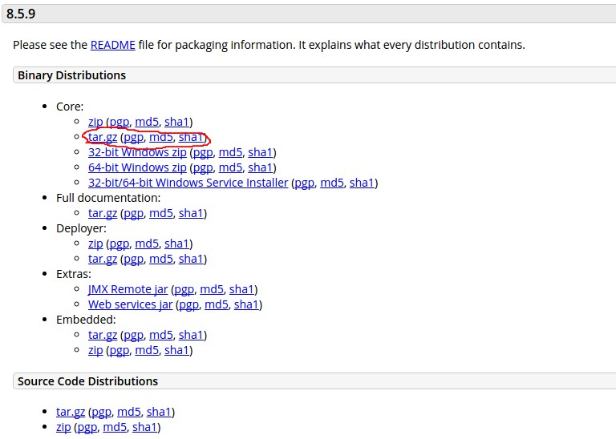
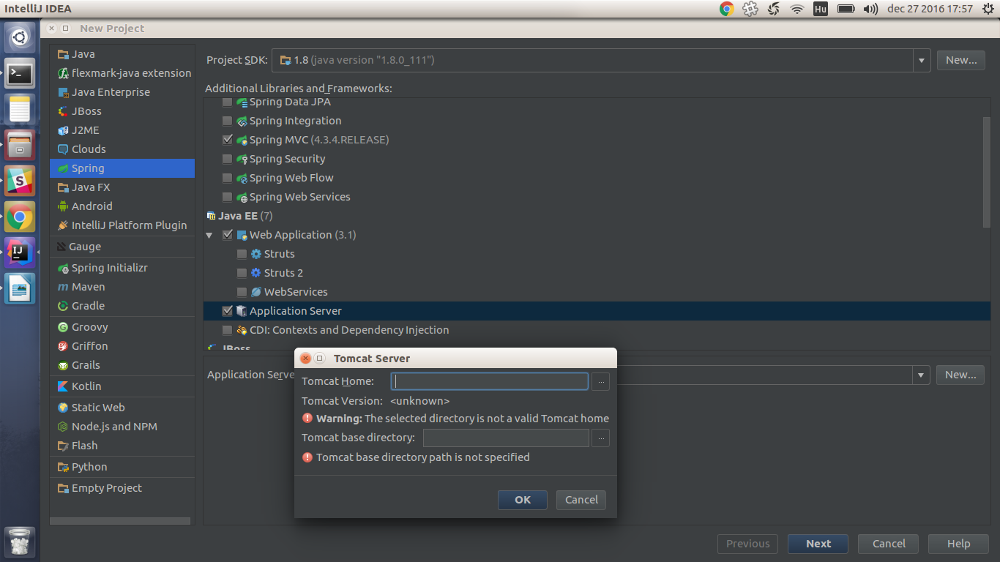
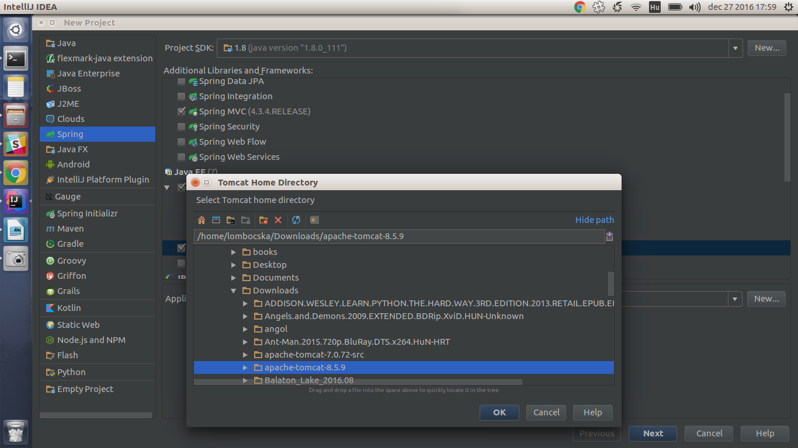

Spring & Hibernate basic app based on the following tutorial:
http://websystique.com/springmvc/spring-4-mvc-and-hibernate4-integration-example-using-annotations/

How to set up:

- Download tomcat core (tar.gz) from: http://tomcat.apache.org/download-80.cgi

- Extract the contents
- You should create a new Project. Then you have to pick Spring on the left pane
- On the right pane pick spring mvc and application server
- On bottom of the window, you can add a new server, you have to pick the downloaded file to determine the path

- Once the project is created, in IntelliJ click Run/Edit Configurations/+/Tomcat/Local
- Press Fix a few times if IntelliJ is complaning
